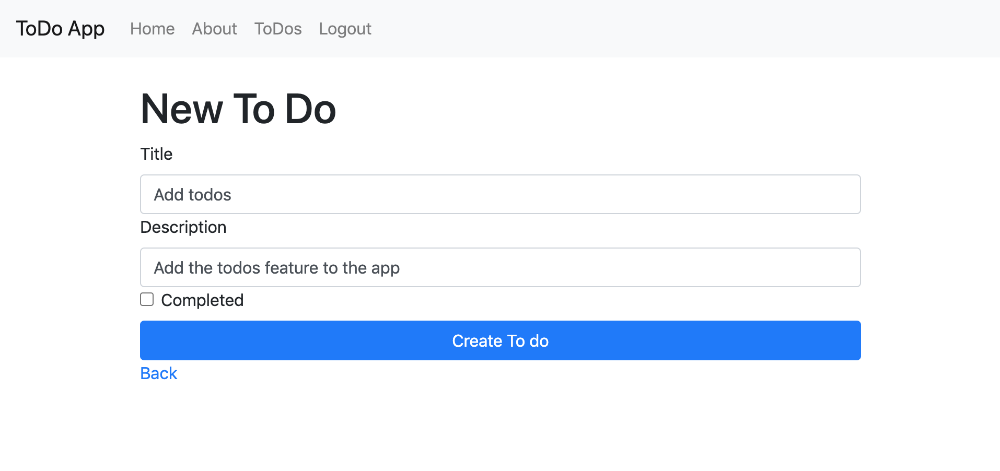

# Rails 4 Tutorial - ToDo App
This tutorial covers creating a ToDo application using Ruby on Rails. The ToDo application will have a few parts.
1. User authentication (User creation, login etc).
2. ToDo create, read, update, destroy (C.R.U.D).

The completed code can be found on my [ToDo App Repository](https://github.com/jonathanmeaney/todo-app).

## 1. Directory setup
Open a new terminal window. Lets create a directory called `Development` in your home directory. This will be where we keep development work. Create a sub directory under `Development` called `rails`. The following commands will create the directory structure.
```
cd
mkdir Development
cd Development
mkdir rails
cd rails
```
## 2. Create and setup the Rails app
Now that the `Development` directory and `rails` directory are created we can create the new rails app.

### 2.1 Check version of Bundler gem
You might need to install an different version of the `bundler` gem. Rails `4.2.11.3` requires less than version 2. To check which version you have run:

```
gem list bundler
```

And you will see something like

```
$ gem list bundler

*** LOCAL GEMS ***

bundler (2.0.1)
```

If you don't have a version less than 2 then you can run this command to install it.

```
gem install bundler -v '1.17.3'
```

You will then need to uninstall the `2.0.1` version.
```
gem uninstall bundler -v '2.0.1'
```
### 2.2 Create the Rails app
Run the following command from the `Development/rails` directory in the terminal.
```
rails new todo-app -d mysql -T
```
The `-d` flag allows you to specify which database should be used by the new application, we're specifying `mySQL` here.
The `-T` flag will tell Rails not to generate a test suite. We will do this separately later.

### 2.2.1 Rails App Structure
You can find an in depth overview of `Rails 4.2` on the official Rails website. https://guides.rubyonrails.org/v4.2/getting_started.html
<table class="responsive">
<thead>
<tr>
<th>File/Folder</th>
<th>Purpose</th>
</tr>
</thead>
<tbody>
<tr>
<td>app/</td>
<td>Contains the controllers, models, views, helpers, mailers and assets for your application. You'll focus on this folder for the remainder of this guide.</td>
</tr>
<tr>
<td>bin/</td>
<td>Contains the rails script that starts your app and can contain other scripts you use to setup, deploy or run your application.</td>
</tr>
<tr>
<td>config/</td>
<td>Configure your application's routes, database, and more. This is covered in more detail in <a href="https://guides.rubyonrails.org/v4.2/configuring.html">Configuring Rails Applications</a>.</td>
</tr>
<tr>
<td>config.ru</td>
<td>Rack configuration for Rack based servers used to start the application.</td>
</tr>
<tr>
<td>db/</td>
<td>Contains your current database schema, as well as the database migrations.</td>
</tr>
<tr>
<td>Gemfile<br>Gemfile.lock</td>
<td>These files allow you to specify what gem dependencies are needed for your Rails application. These files are used by the Bundler gem. For more information about Bundler, see the <a href="http://bundler.io">Bundler website</a>.</td>
</tr>
<tr>
<td>lib/</td>
<td>Extended modules for your application.</td>
</tr>
<tr>
<td>log/</td>
<td>Application log files.</td>
</tr>
<tr>
<td>public/</td>
<td>The only folder seen by the world as-is. Contains static files and compiled assets.</td>
</tr>
<tr>
<td>Rakefile</td>
<td>This file locates and loads tasks that can be run from the command line. The task definitions are defined throughout the components of Rails. Rather than changing Rakefile, you should add your own tasks by adding files to the lib/tasks directory of your application.</td>
</tr>
<tr>
<td>README.rdoc</td>
<td>This is a brief instruction manual for your application. You should edit this file to tell others what your application does, how to set it up, and so on.</td>
</tr>
<tr>
<td>tmp/</td>
<td>Temporary files (like cache, pid, and session files).</td>
</tr>
<tr>
</tbody>
</table>

### 2.2.2 Database credentials
`cd` into the `todo-app` application directory and open it in `VS Code`. We need to update some configuration. The file `config/database.yml` contains the credentials required for connecting to the database so those will need to be updated to let the app connect. Give the `username` and `password` that you set when installing `mySQL`. This is what my default config looks like from `config/database.yml`.
```yaml
default: &default
  adapter: mysql2
  encoding: utf8
  pool: 5
  username: root
  password: root
  socket: /tmp/mysql.sock
```

### 2.2.3 Create Databases
Now tha the credentials are specified the application should be able to access `mySQL`. We'll use Rake to run a command to create the databases. `Rake` is a task runner and is used for running some automated tasks in `Rails`. One of these tasks is to create the databases the app is going to use. To do that you can run.
```
bundle exec rake db:create
```
This will create the `todo-app_development` and `todo-app_test` databases. The `_development` database is where the app data will live and the `_test` database is used during automated tests.

### 2.2.4 Test the server
Now that the database is setup lets test that the server will start. Run the following command to start the server:
```
bundle exec rails s
```
This will start the server and you can access it from the browser if you visit `http://localhost:3000/`. If all has gone well then you will see this page.

If you see this then everything has been successful so far! You can stop the server by pressing `ctrl+c` so do that now, we are going to make some changes the server should be stopped for.

## 3 Adding RSpec
We use RSpec for testing. https://rspec.info/ and documentation https://relishapp.com/rspec

### 3.1 Adding gems required for RSpec
We need to add the gems required for RSpec to the `Gemfile`. Add `gem 'rspec-rails', '~> 3.9'` to the `Gemfile` inside the `:development, :test` group. This is how it should look after adding the gem.
```ruby
group :development, :test do
  # Call 'byebug' anywhere in the code to stop execution and get a debugger console
  gem 'byebug'
  gem 'rspec-rails', '~> 3.9'
end
```
After adding the gem then from the terminal in the `todo-app` root directory run:
```
bundle install
```
This will install the gems. You should see something like this in the output.
```
Installing rspec-support 3.9.4
Fetching rspec-core 3.9.3
Installing rspec-core 3.9.3
Fetching rspec-expectations 3.9.3
Installing rspec-expectations 3.9.3
Using rspec-mocks 3.9.1
Fetching rspec-rails 3.9.1
Installing rspec-rails 3.9.1
```

### 3.2 Generating boilerplate configuration for RSpec
After installing the RSpec gems we need to generate the boilerplate configuration for them to use. We will use the Rails `generate` command to do this. From the terminal in the `todo-app` root directory run:
```
bundle exec rails generate rspec:install
```
You should see this output:
```
create  .rspec
create  spec
create  spec/spec_helper.rb
create  spec/rails_helper.rb
```
The generator has created a new directory in our application called `spec` along with some helper classes. This directory is where all our tests will live. RSpec should now be configured for use with our application.

## 4 Pushing to Github
Now the basic app skeleton is created lets create a repo on Github for the application and push up what we have so far.

### 4.1 Create the repository on Github for the Todo App

Login to Github and go to https://github.com/new to create a new repository. Give the repository the name `todo-app` and a description if you life. The form will look like this.


And when you click on `Create repository` you should see the empty repository like so:


At the moment the repository is empty so lets fix that.

### 4.2 Initialize the ToDo App for Github

From the `todo-app` root directory run the following command to initialize the directory for use with Github.

```
git init
```
If you now run:
```
git status
```
It will print out some info about the local repository such as what branch you're on and what files have been changes since the last push to Github. It will look like this at the moment.
```
On branch master

No commits yet

Untracked files:
  (use "git add <file>..." to include in what will be committed)

        .gitignore
        Gemfile
        Gemfile.lock
        README.rdoc
        Rakefile
        app/
        bin/
        config.ru
        config/
        db/
        lib/
        log/
        public/
        vendor/
```

### 4.3 Adding files
Currently none of the files in the `todo-app` root directory are added to the repository. To add them all run:
```
git add .
```
After that running `git status` again will show that all the files have been added and will look like so:
```
On branch master

No commits yet

Changes to be committed:
  (use "git rm --cached <file>..." to unstage)

        new file:   .gitignore
        new file:   Gemfile
        new file:   Gemfile.lock
        new file:   README.rdoc
        new file:   Rakefile
        new file:   app/assets/images/.keep
        new file:   app/assets/javascripts/application.js
        new file:   app/assets/stylesheets/application.css
        new file:   app/controllers/application_controller.rb
        new file:   app/controllers/concerns/.keep
        new file:   app/helpers/application_helper.rb
        new file:   app/mailers/.keep
        new file:   app/models/.keep
        new file:   app/models/concerns/.keep
        new file:   app/views/layouts/application.html.erb
        new file:   bin/bundle
        new file:   bin/rails
        new file:   bin/rake
        new file:   bin/setup
        new file:   config.ru
        new file:   config/application.rb
        new file:   config/boot.rb
        new file:   config/database.yml
        new file:   config/environment.rb
        new file:   config/environments/development.rb
        new file:   config/environments/production.rb
        new file:   config/environments/test.rb
        new file:   config/initializers/assets.rb
        new file:   config/initializers/backtrace_silencers.rb
        new file:   config/initializers/cookies_serializer.rb
        new file:   config/initializers/filter_parameter_logging.rb
        new file:   config/initializers/inflections.rb
        new file:   config/initializers/mime_types.rb
        new file:   config/initializers/session_store.rb
        new file:   config/initializers/to_time_preserves_timezone.rb
        new file:   config/initializers/wrap_parameters.rb
        new file:   config/locales/en.yml
        new file:   config/routes.rb
        new file:   config/secrets.yml
        new file:   db/seeds.rb
        new file:   lib/assets/.keep
        new file:   lib/tasks/.keep
        new file:   log/.keep
        new file:   public/404.html
        new file:   public/422.html
        new file:   public/500.html
        new file:   public/favicon.ico
        new file:   public/robots.txt
        new file:   vendor/assets/javascripts/.keep
        new file:   vendor/assets/stylesheets/.keep
```

### 4.2 Creating first commit
Now that all the files have been added we are ready to create out first commit. This commit will consist of all the files (or changes) that have been added. To create the commit run:
```
git commit -m 'first commit'
```
The `-m` flag is the message to accompany the commit, the first one is very simple but generally the messages should be more descriptive like `Adding feature X and feature Y and fixing bug A`

### 4.3 Adding remote repository
We have a commit created and ready to push to Github but we need to tell git where to send the commit. We need to add the remote repository we created previously on Github. If you look at the empty repo you will see the command we need to run in order to add the remote repository. Its highlighted here.


Replace USERNAME with your own and run the following command from the `todo-app` root directory:
```
git remote add origin git@github.com:USERNAME/todo-app.git
```

### Pushing to Github

Now that everything is ready lets push the app to Github. Run the following command:
```
git push -u origin master
```
You will see output like this:
```
Enumerating objects: 62, done.
Counting objects: 100% (62/62), done.
Delta compression using up to 8 threads
Compressing objects: 100% (51/51), done.
Writing objects: 100% (62/62), 16.77 KiB | 858.00 KiB/s, done.
Total 62 (delta 2), reused 0 (delta 0)
remote: Resolving deltas: 100% (2/2), done.
To github.com:jonathanmeaney/todo-app.git
 * [new branch]      master -> master
Branch 'master' set up to track remote branch 'master' from 'origin'.
```
The `-u origin` is the remote repository called origin. This was created when we ran the command above to add the remote. And `master` is the name of the branch to push.

If you go to Github and to your repository you will see that all the files have been pushed up.


Now that Github is setup lets move onto creating our first resource in the app.

## 5 Generators
> Rails comes with a number of scripts called generators that are designed to make your development life easier by creating everything that's necessary to start working on a particular task.

<table>
<tr><th>Generator</th><th>Description</th></tr>
<tr><th>controller</th><td>Generate a new controller along with any corresponding views and tests. The syntax of the command is the controller generator followed by the name for the controller, singular names usually and following that a list of views can be specified to generate along with the controller:
E.G. <b>bundle exec rails generate controller Post index show view</b>
</td></tr>
<tr><th>job</th><td>Generate a new Job class. Jobs are tasks that can be done in a background asynchronous process.</td></tr>
<tr><th>mailer</th><td>Generate a new mailer for sending emails.</td></tr>
<tr><th>migration</th><td>Generate a migration. A migration is some task that will be carried out on the database. For example, adding a new column to a table, creating a new table, adding an index etc. the syntax for the command is the migration generator followed by a name for the migration and afterwards a set of options or list of fields:
E.G. <b>bundle exec rails generate migration AddFieldToModel name:string age:integer</b>
</td></tr>
<tr><th>model</th><td>Generate a new model. This will create the model class file along with a migration to create the corresponding table in the database. The syntax is the model generator followed by a name for the model, singular names usually. A list of fields and types can also be specified following the pattern <b>field:type</b>.
E.G. <b>bundle exec rails generate model Person name:string email:string age:integer dob:date admin:boolean</b>
</td></tr>
<tr><th>scaffold</th><td>Generate a scaffold for a resource. This will generate a controller with typical CRUD actions, views, a model and a migration all in one go. Similar to the <b>model</b> generator you can specify a list of fields and types with this generator to populate the model with.
E.G. <b>bundle exec rails generate scaffold Person name:string email:string age:integer dob:date admin:boolean</b>
</td></tr>
</table>

## 6 Create the Homepage

## 6.1 Creating the controller
First open the `Gemfile` there is something we need to remove. We don't use `CoffeeScript` (CoffeeScript is a language that compiles into JavaScript) but the gem gets included by default. To prevent Rails from generating `CoffeeScript` files we need to remove it from the `Gemfile`. Delete the lines:
```
# Use CoffeeScript for .coffee assets and views
gem 'coffee-rails', '~> 4.1.0'
```
Now with `CoffeeScript` removed, we're going to use one of the generators from the table above.

The `controller` generator creates controllers and optionally views to accompany. We will create a controller for generate application pages that will be available to anyone without an account. We will call the controller `Site` and give it two views `index` and `about`. The generator command looks like so:
```
bundle exec rails generate controller Site index about
```
You will see the following file creation output from running the command:
```
create  app/controllers/site_controller.rb
  route  get 'site/about'
  route  get 'site/index'
invoke  erb
create    app/views/site
create    app/views/site/index.html.erb
create    app/views/site/about.html.erb
invoke  rspec
create    spec/controllers/site_controller_spec.rb
create    spec/views/site
create    spec/views/site/index.html.erb_spec.rb
create    spec/views/site/about.html.erb_spec.rb
invoke  helper
create    app/helpers/site_helper.rb
invoke    rspec
create      spec/helpers/site_helper_spec.rb
invoke  assets
invoke    js
create      app/assets/javascripts/site.js
invoke    scss
create      app/assets/stylesheets/site.scss
```

### 6.2 Updating the router
The router is located in `config/routes.rb` and:

> The Rails router recognizes URLs and dispatches them to a controller's action, or to a Rack application. It can also generate paths and URLs, avoiding the need to hardcode strings in your views.

You can read more about it in the [documentation](https://guides.rubyonrails.org/routing.html)

We need to make a few updates so that our new controller can be navigated to in the browser. The router lets you set a `root` path and this will be our `homepage`. The homepage will be the `index` view of the `Site` controller we just created.

The `root` method specifies which page should be matched to `/`. Update the `config/routes.rb` file like to add `Site index` as the root. Also removing the routes `get 'site/index'` and `get 'site/about'` that the generator automatically added. The updated routes will look like so.

```ruby
Rails.application.routes.draw do
  root to: "site#index"
  get 'about', to: 'site#about'
  ...
  ...
  ...
```
Now start the server with:
```
bundle exec rails server
```
And navigate to `http://localhost:3000` in the browser and you will see this beautiful page.


### 6.3 Beautify the application
We're going to import `Bootstrap` to make things look a lot better.
>Bootstrap is the most popular HTML, CSS, and JS framework for developing responsive, mobile first projects on the web.

The getting started documentation for `Bootstrap` is [here](https://getbootstrap.com/docs/4.5/getting-started/introduction/) and all the different components that `Bootstrap` provides are [here](https://getbootstrap.com/docs/4.5/components/alerts/).

The `app/views/layouts/application.html.erb` file contains the general structure and layout of our application. It is here where the general navigation will go. When navigating to a new page Rails will inject the content of that page into `<%= yield %>` meaning we don't need to keep repeating elements such as the navigation bar on each page. We just add it in the layouts once.

Replace the contents of `app/views/layouts/application.html.erb` with the following. This will include the styling for `Bootstrap` and also give up a [navbar](https://getbootstrap.com/docs/4.5/components/navbar/) at the top to navigate between pages.

```html
<!DOCTYPE html>
<html>
  <head>
    <title>TodoApp</title>
    <!-- Required meta tags -->
    <meta charset="utf-8">
    <meta name="viewport" content="width=device-width, initial-scale=1, shrink-to-fit=no">
    <!-- Latest compiled and minified CSS -->
    <link rel="stylesheet" href="https://cdn.jsdelivr.net/npm/bootstrap@4.5.3/dist/css/bootstrap.min.css" integrity="sha384-TX8t27EcRE3e/ihU7zmQxVncDAy5uIKz4rEkgIXeMed4M0jlfIDPvg6uqKI2xXr2" crossorigin="anonymous">

    <!-- Latest compiled and minified JavaScript -->
    <script src="https://code.jquery.com/jquery-3.5.1.slim.min.js" integrity="sha384-DfXdz2htPH0lsSSs5nCTpuj/zy4C+OGpamoFVy38MVBnE+IbbVYUew+OrCXaRkfj" crossorigin="anonymous"></script>
    <script src="https://cdn.jsdelivr.net/npm/popper.js@1.16.1/dist/umd/popper.min.js" integrity="sha384-9/reFTGAW83EW2RDu2S0VKaIzap3H66lZH81PoYlFhbGU+6BZp6G7niu735Sk7lN" crossorigin="anonymous"></script>
    <script src="https://cdn.jsdelivr.net/npm/bootstrap@4.5.3/dist/js/bootstrap.min.js" integrity="sha384-w1Q4orYjBQndcko6MimVbzY0tgp4pWB4lZ7lr30WKz0vr/aWKhXdBNmNb5D92v7s" crossorigin="anonymous"></script>
    <%= stylesheet_link_tag    'application', media: 'all', 'data-turbolinks-track' => true %>
    <%= javascript_include_tag 'application', 'data-turbolinks-track' => true %>
    <%= csrf_meta_tags %>
  </head>
  <body>
    <nav class="navbar navbar-expand-md navbar-light bg-light">
      <a class="navbar-brand" href="#">ToDo App</a>
      <button class="navbar-toggler" type="button" data-toggle="collapse" data-target="#navbarsExampleDefault" aria-controls="navbarsExampleDefault" aria-expanded="false" aria-label="Toggle navigation">
        <span class="navbar-toggler-icon"></span>
      </button>

      <div class="collapse navbar-collapse" id="navbarsExampleDefault">
        <ul class="navbar-nav mr-auto">
          <li class="nav-item">
            <a class="nav-link" href="/">Home</a>
          </li>
          <li class="nav-item">
            <a class="nav-link" href="/about">About</a>
          </li>
        </ul>
      </div>
    </nav>
    <div class="container">
      <br/>
      <%= yield %>
    </div><!-- /.container -->
  </body>
</html>
```
Refresh the browser and you should see the following.


### 6.4 Improve the homepage

We're going to use the [jumbotron](https://getbootstrap.com/docs/4.5/components/jumbotron/) component from `Bootstrap` to make the homepage look a bit nicer.

Replace the contents of `app/views/site/index.html.erb` with:
```html
<div class="jumbotron">
  <h1 class="display-4">Welcome!</h1>
  <p class="lead">Welcome to the ToDo App!</p>
  <hr class="my-4">
  <p>Its built using Ruby on Rails 4.2 and Bootstrap 4.</p>
  <a class="btn btn-primary btn-lg" href="/about" role="button">Learn more</a>
</div>
```
And if you refresh the page in the browser you will see this!


Its looking more like an app now!

### Push up the new controller and style changes to Github

1. Run `git status` and see all the new files and updates that have been added.
2. Add everything again using `git add .` and then run `git status` again to see all the changes have been added.
3. Now create a new commit `git commit -m 'Adding Site controller and improving style'`
4. Push with `git push -u origin master`

## 7 Create the User

### 7.1 Create a new branch for adding User
Lets start using branches for new features and work. We are already up to date with master so we can create a new branch on which to add `User`. Its always a good idea to check if there are any uncommitted changes before changing branches or creating a new one. Run:
```
git status
```
and you will see something like this:
```
On branch master
Your branch is up to date with 'origin/master'.

nothing to commit, working tree clean
```
This means there are no changes made so we can change branches or create a new one without any issue. The easiest way to create a new branch and to check it out is with the following command `git checkout -b <branch-name>`. Lets use it to create a branch for users:
```
git checkout -b adding-users
```
The `adding-users` branch has been created, you can also run `git status` to verify the branch you are one. Running it now will show:
```
On branch adding-users
nothing to commit, working tree clean
```

### 7.2 Generating the User model
We are going to use the model generator to create the `User` model. A user will have 2 attributes `email` and `password`. The password however will be saved as `password_digest` in the database. The password will be encrypted. Run the following command to generate the `User` model. `email` and `password_digest` are the table fields, usually you would specify what the field type is too e.g. `age:integer dob:date` but if you don't specify the type it will default to `string`.

```
bundle exec rails generate model User email password_digest
```
You should see the following output from the command. You can see the `migration` file being generated in the `db/migrate` directory. The migration file will contain code to generate the `users` table in the database with the `email` and `password_digest` fields along with some timestamp fields. Rails adds an auto incrementing `id` field too. The model class gets created and also since we have RSpec installed a test file for the model is also generated.
```
invoke  active_record
create    db/migrate/20201028134028_create_users.rb
create    app/models/user.rb
invoke    rspec
create      spec/models/user_spec.rb
```
Now the model is created along with the migration to update the database we need to run a rake task to run the migration. Running:
```
bundle exec rake db:migrate
```
will run any outstanding migrations that have not been run yet (Rails keeps track of which migrations have been run using the `schema_migrations` table that it automatically creates for us). You should see some output like the following from the migration:
```
== 20201028134028 CreateUsers: migrating ======================================
-- create_table(:users)
   -> 0.0547s
== 20201028134028 CreateUsers: migrated (0.0548s) ====================
```
This means that the table has been created in the database. If you view the database now you will see the tablas has been created along with the `schema_migrations` table discussed above.


### 7.3 Adding bcrypt gem for encrypting password

> bcrypt() is a sophisticated and secure hash algorithm designed by The OpenBSD project for hashing passwords. The bcrypt Ruby gem provides a simple wrapper for safely handling passwords.

We're going to use this gem for encrypting passwords. Open the `Gemfile` and add `gem 'bcrypt', '3.1.16'` to it, I put it under the `sdoc` gem. After adding this to the `Gemfile` we need to get bundler to install the gem for us. Running:
```
bundle install
```
will install the gem for us to use in the application.

When that is done open `app/models/user.rb`. Rails has an in build feature to handle encrypting passwords. We need to add `has_secure_password` to the `User` model.

> has_secure_password Adds methods to set and authenticate against a BCrypt password

more info can be found in the [documentation](https://api.rubyonrails.org/classes/ActiveModel/SecurePassword/ClassMethods.html#method-i-has_secure_password)

After updating the `user.rb` it should look like this:
```ruby
class User < ActiveRecord::Base
  has_secure_password
end
```
Now our user model will have the ability to work with passwords and encrypting.

### 7.4 Generating the Users controller

Now the `User` model is in place we need to create a `controller` to interact with the model and allow us to create new users. Using the `controller` generator generate a controller with `new` and `create` views and actions.

```
bundle exec rails generate controller Users new create
```
The output of the command looks like this, creating all the different files.
```
create  app/controllers/users_controller.rb
  route  get 'users/create'
  route  get 'users/new'
invoke  erb
create    app/views/users
create    app/views/users/new.html.erb
create    app/views/users/create.html.erb
invoke  rspec
create    spec/controllers/users_controller_spec.rb
create    spec/views/users
create    spec/views/users/new.html.erb_spec.rb
create    spec/views/users/create.html.erb_spec.rb
invoke  helper
create    app/helpers/users_helper.rb
invoke    rspec
create      spec/helpers/users_helper_spec.rb
invoke  assets
invoke    js
create      app/assets/javascripts/users.js
invoke    scss
create      app/assets/stylesheets/users.scss
```

### 7.5 Update routes for User controller
The router has a method `resources` which will auto generate routes for a controller. We're going to use it for `users`. The method can also take several options including the `only` array. This is an array of actions to generate routes for. We only have `new` and `create` actions defined in the `UsersController` so we should only generate routes for those. Update the `config/routes.rb` with the new `resources` line for users. The code is below.

```ruby
Rails.application.routes.draw do
  root to: "site#index"
  get 'about', to: 'site#about'
  resources :users, only: [:new, :create]
  ...
  ...
  ...
```
Another handy rake task is `routes` this will print out all the routes currently defined and where they route to. Its very useful. If you run:
```
bundle exec rake routes
```
You'll get output like the following which lists all the defined routes along with the http verb used to access it. It also details which controller and action the route will go to.
```
  Prefix Verb URI Pattern          Controller#Action
    root GET  /                    site#index
   about GET  /about(.:format)     site#about
   users POST /users(.:format)     users#create
new_user GET  /users/new(.:format) users#new
```

### 7.6 Adding link to signup
We need to make an update to the UI to provide a link to the new user page. We're going to use one of the Rails view helper methods called `link_to` to generate the link. Rails has many view methods but you can find out more about `link_to` [here](https://apidock.com/rails/v5.2.3/ActionView/Helpers/UrlHelper/link_to).

Open the `app/views/layouts/application.html.erb` and we will modify the `ul` inside the navbar. These links are the navigation for the application. We're going to replace these HTML links with the `link_to` rails helper method.

```html
<a class="nav-link" href="/">Home</a>
becomes
<%= link_to 'Home', root_path, class: 'nav-link' %>
```
and
```html
<a class="nav-link" href="/about">About</a>
becomes
<%= link_to 'About', about_path, class: 'nav-link' %>
```
we will also add a new link to get to the register page.
```html
<li class="nav-item">
  <%= link_to 'Register', new_user_path, class: 'nav-link' %>
</li>
```
Together the final changes will look like this:
```erb
<ul class="navbar-nav mr-auto">
  <li class="nav-item">
    <%= link_to 'Home', root_path, class: 'nav-link' %>
  </li>
  <li class="nav-item">
    <%= link_to 'About', about_path, class: 'nav-link' %>
  </li>
  <li class="nav-item">
    <%= link_to 'Register', new_user_path, class: 'nav-link' %>
  </li>
</ul>
```
In the `link_to` method the first parameter is the text to display in the rendered link in the HTML.

The second parameter is the URL for the link. Notice that the URL matches the prefix of the routes printed above when running `bundle exec rake routes`. Rails auto generates methods for each of these route prefixes and appending `_path` just returns the path for that particular route. So `home_path` would return `/` and `about_path` would return `/about` and `new_user_path` would return `/users/new`.

The last parameter of the `link_to` are just an additional HTML options needed, classes, id anything like that. We're keeping the class needed for Bootstrap to apply styles.

Refresh the browser page and you should see the new link added to the navigation menu and clicking it will bring you to the `app/views/users/new.html.erb` page.


### 7.7 Creating signup form

Open up `app/views/users/new.html.erb`, we're going to update it to include a form for registering as a new user using some of the Rails form helper methods and Bootstrap again. Replace the contents of the file with the following code:

```erb
<h1>Register</h1>
<p>Enter your details below to register!</p>

<%= form_for @user do |f|%>
  <div class="form-group">
    <%= f.label :email%>
    <%= f.email_field :email, class: 'form-control'%>
  </div>
  <div class="form-group">
    <%= f.label :password%>
    <%= f.password_field :password, class: 'form-control'%>
  </div>
  <button type="submit" class="btn btn-primary btn-block">Register</button>
<% end %>
```
This form is using the `form_for` helper. You can learn more about form helpers [here](https://guides.rubyonrails.org/v4.2/form_helpers.html). 

The `form_for` helper will generate a HTML form tag and populate its action appropriately. We've specified here the form is for a `@user` object. The helper method will use this to determine what the action of the form should be.

We are also using the `email_field` helper and the `password_field` helper to generate the input fields for email and password. Input helpers need the name of the attribute they are representing, the user `:email` and `:password` in this instance.

The above code will generate the following HTML if you inspect the browser page.

```html
<form class="new_user" id="new_user" action="/users" accept-charset="UTF-8" method="post"><input name="utf8" type="hidden" value="✓">
  <input type="hidden" name="authenticity_token" value="jCYJesIMUoRawylhzQiqaPRADGwbhyqQxq2LNPVfZQfNBF+6V8wIrLwXcKe166uUD1xprMZ3cgtspLaoffaF4g==">
  <div class="form-group">
    <label for="user_email">Email</label>
    <input class="form-control" type="email" name="user[email]" id="user_email" autocomplete="off">
  </div>
  <div class="form-group">
    <label for="user_password">Password</label>
    <input class="form-control" type="password" name="user[password]" id="user_password" autocomplete="off">
  </div>
  <button type="submit" class="btn btn-primary btn-block">Register</button>
</form>
```
If you refresh the browser after making this change adding the form you will see this error:


We're created a form for a new user object but we haven't actually created that user object yet. To fix this open `app/controllers/users_controller.rb`. We're going to make a change to the `new` action. This action corresponds with the `app/views/users/new.html.erb` view, any instance variables (variables starting with @) declared in this method will be accessible from the corresponding view. So in the `new` action declare a `@user` object to be a new instance of the `User` model. The code will look like this:
```ruby
class UsersController < ApplicationController
  def new
    @user = User.new
  end

  def create
  end
end
```
Now if you refresh the browser the error will be resolved and you will see the form.


### 7.8 Creating a new user
The form is in place when we submit it won't create a new user. That functionality needs to be added now. If we have another look at the routes by running `bundle exec rake routes`

```
  Prefix Verb URI Pattern          Controller#Action
    root GET  /                    site#index
   about GET  /about(.:format)     site#about
   users POST /users(.:format)     users#create
new_user GET  /users/new(.:format) users#new
```
we can see that using the `POST` verb to `/users` will route to the `create` action in the `users` controller. So we need to prepare that action to receive the data from the form and then use it to create a new `User` record in the database.

Open `app/controllers/users_controller.rb`. We will make a few changes. Data coming from the form will be in a `params` hash object that rails provides. So we can retrieve the values from the `params`. But retrieving them directly from the `param` isn't a good idea because anything can be in there. Theres a way to ensure that only the correct parameters are allowed.

We're going to add a private method called `user_params`. This will use `Strong Parameters` which is a way of encapsulating permissible parameters. It will prevent other data being injected into the payload and making its way into the app. You can read more about strong parameters in the [documentation](https://edgeapi.rubyonrails.org/classes/ActionController/StrongParameters.html)

Im the `user_params` method we specify that the params requires a `user` object and we also specify the fields that are permissable. The `user_params` method will look like this.

```ruby
def user_params
  params.require(:user).permit(:email, :password)
end
```
This is a pattern you should use for all data coming from forms in  controllers.

Now that the `user_params` method is in place lets use it. Inside the `create` action we will use the `ActiveRecord` `create` method which is available to models. This will accept a hash of field params and create a new object with the params and save it to the database. After the user is created and saved we then store the `id` of the the user in the `session` this will be used to keep track of authentication status.

This is how the create method looks after these changes.
```ruby
def create
  @user = User.create(user_params)
  session[:user_id] = @user.id
end
```
The whole controller should look like this when all these changes have been made to support creating a new user.
```ruby
class UsersController < ApplicationController
  def new
    @user = User.new
  end

  def create
    @user = User.create(user_params)
    session[:user_id] = @user.id
  end

  private

  def user_params
    params.require(:user).permit(:email, :password)
  end
end
```
Now return to the new user form in the browser, fill it in and submit. The screen wont show much at this point but if you inspect the database you will see the new user record with has been created.


### 7.9 Pushing new branch and changes to github
Its time to push up the users feature and create a pull request. Running `git status` will show all the changes so far. Files modified and added.
```
On branch adding-users
Changes not staged for commit:
  (use "git add <file>..." to update what will be committed)
  (use "git checkout -- <file>..." to discard changes in working directory)

        modified:   Gemfile
        modified:   Gemfile.lock
        modified:   app/views/layouts/application.html.erb
        modified:   config/routes.rb

Untracked files:
  (use "git add <file>..." to include in what will be committed)

        app/assets/javascripts/users.js
        app/assets/stylesheets/users.scss
        app/controllers/users_controller.rb
        app/helpers/users_helper.rb
        app/models/user.rb
        app/views/users/
        db/migrate/
        db/schema.rb
        spec/controllers/users_controller_spec.rb
        spec/helpers/users_helper_spec.rb
        spec/models/
        spec/views/user/
        spec/views/users/
```
Again we will add all of these changes with `git add .` and then running `git status` again will show:
```
On branch adding-users
Changes to be committed:
  (use "git reset HEAD <file>..." to unstage)

        modified:   Gemfile
        modified:   Gemfile.lock
        new file:   app/assets/javascripts/users.js
        new file:   app/assets/stylesheets/users.scss
        new file:   app/controllers/users_controller.rb
        new file:   app/helpers/users_helper.rb
        new file:   app/models/user.rb
        modified:   app/views/layouts/application.html.erb
        new file:   app/views/users/create.html.erb
        new file:   app/views/users/new.html.erb
        modified:   config/routes.rb
        new file:   db/migrate/20201028134028_create_users.rb
        new file:   db/schema.rb
        new file:   spec/controllers/users_controller_spec.rb
        new file:   spec/helpers/users_helper_spec.rb
        new file:   spec/models/user_spec.rb
        new file:   spec/views/user/create.html.erb_spec.rb
        new file:   spec/views/user/new.html.erb_spec.rb
        new file:   spec/views/users/create.html.erb_spec.rb
        new file:   spec/views/users/new.html.erb_spec.rb
```
Now all the changes are added lets create a commit with `git commit -m 'Adding users feature with registration.'` and then we need to push. Since we are on the `adding-users` branch we need to push to that one on Github and not `master`. So the command to push will be:
```
git push -u origin adding-users
```
And you should see the following output, including a section where the new branch gets created in the remote repository.
```
Enumerating objects: 61, done.
Counting objects: 100% (61/61), done.
Delta compression using up to 8 threads
Compressing objects: 100% (38/38), done.
Writing objects: 100% (41/41), 4.77 KiB | 542.00 KiB/s, done.
Total 41 (delta 10), reused 0 (delta 0)
remote: Resolving deltas: 100% (10/10), completed with 7 local objects.
remote:
remote: Create a pull request for 'adding-users' on GitHub by visiting:
remote:      https://github.com/jonathanmeaney/todo-app/pull/new/adding-users
remote:
To github.com:jonathanmeaney/todo-app.git
 * [new branch]      adding-users -> adding-users
Branch 'adding-users' set up to track remote branch 'adding-users' from 'origin'.
```

### 7.10 Opening a pull request
On Github click on the `New pull request` button. The branch on the left is the branch we want to merge change into and the branch on the right has the changes we want to merge. Pick `master` as the branch on the left and `adding-users` as the branch on the right.


Give your pull request a title and description, assign it to yourself on the right. If you require any reviewers you can add them here too. Click on `Create pull request`. This will create your pull request.


Clicking on the `Files changed` tab will show all the changes included in the pull request.


This pull request doesn't require a review from other developers so for now you can merge it so open the pull request and click on the `merge` button.


Now that the pull request has been merged to `master` we need to switch branches to `master` locally and pull down the latest changes.

From the root of the `todo-app` run `git status` to make sure you have no outstanding changes that need committing. If all is clear then change branches to `master` with:
```
git checkout master
```
You will see this output in the terminal:
```
Switched to branch 'master'
Your branch is behind 'origin/master' by 2 commits, and can be fast-forwarded.
  (use "git pull" to update your local branch)
```
This means that the version of `master` on your machine is behind that on the remote repository and the new changes need to be pulled to keep in sync. Running `git pull` will pull all the new changes form the remote version of `master`. You will see this in the terminal, all the files that we merged from the `adding-users` branch are now on `master`:
```
Updating a8458c5..b510d36
Fast-forward
 Gemfile                                   |  3 +--
 Gemfile.lock                              |  2 ++
 app/assets/javascripts/users.js           |  2 ++
 app/assets/stylesheets/users.scss         |  3 +++
 app/controllers/users_controller.rb       | 16 ++++++++++++++++
 app/helpers/users_helper.rb               |  2 ++
 app/models/user.rb                        |  3 +++
 app/views/layouts/application.html.erb    |  7 +++++--
 app/views/users/create.html.erb           |  2 ++
 app/views/users/new.html.erb              | 14 ++++++++++++++
 config/routes.rb                          |  2 +-
 db/migrate/20201028134028_create_users.rb | 10 ++++++++++
 db/schema.rb                              | 23 +++++++++++++++++++++++
 spec/controllers/users_controller_spec.rb | 19 +++++++++++++++++++
 spec/helpers/users_helper_spec.rb         | 15 +++++++++++++++
 spec/models/user_spec.rb                  |  5 +++++
 spec/views/user/create.html.erb_spec.rb   |  5 +++++
 spec/views/user/new.html.erb_spec.rb      |  5 +++++
 spec/views/users/create.html.erb_spec.rb  |  5 +++++
 spec/views/users/new.html.erb_spec.rb     |  5 +++++
 20 files changed, 143 insertions(+), 5 deletions(-)
 create mode 100644 app/assets/javascripts/users.js
 create mode 100644 app/assets/stylesheets/users.scss
 create mode 100644 app/controllers/users_controller.rb
 create mode 100644 app/helpers/users_helper.rb
 create mode 100644 app/models/user.rb
 create mode 100644 app/views/users/create.html.erb
 create mode 100644 app/views/users/new.html.erb
 create mode 100644 db/migrate/20201028134028_create_users.rb
 create mode 100644 db/schema.rb
 create mode 100644 spec/controllers/users_controller_spec.rb
 create mode 100644 spec/helpers/users_helper_spec.rb
 create mode 100644 spec/models/user_spec.rb
 create mode 100644 spec/views/user/create.html.erb_spec.rb
 create mode 100644 spec/views/user/new.html.erb_spec.rb
 create mode 100644 spec/views/users/create.html.erb_spec.rb
 create mode 100644 spec/views/users/new.html.erb_spec.rb
```

## 8 User Login
Now we can create users we need a way for them to be able to login. In order to handle user authentication we will add another controller to do this. The `Sessions` controller. The user will be able to login and logout using this controller.

### 8.1 Create new branch for user login work
First create a new branch that all this user login work will go onto. Run `git status` to make sure you have no uncommitted files and then create a new branch with:
```
git checkout -b adding-user-login
```

### 8.2 Creating Sessions controller
Now we're on the new branch use the `generate` generator to create a new controller called `Sessions` with `new`, `create` and `welcome` actions.
```
bundle exec rails generate controller Sessions new create welcome
```
You will see the following output creating the controller and the associated views and other pieces.
```
create  app/controllers/sessions_controller.rb
  route  get 'sessions/welcome'
  route  get 'sessions/create'
  route  get 'sessions/new'
invoke  erb
create    app/views/sessions
create    app/views/sessions/new.html.erb
create    app/views/sessions/create.html.erb
create    app/views/sessions/welcome.html.erb
invoke  rspec
create    spec/controllers/sessions_controller_spec.rb
create    spec/views/sessions
create    spec/views/sessions/new.html.erb_spec.rb
create    spec/views/sessions/create.html.erb_spec.rb
create    spec/views/sessions/welcome.html.erb_spec.rb
invoke  helper
create    app/helpers/sessions_helper.rb
invoke    rspec
create      spec/helpers/sessions_helper_spec.rb
invoke  assets
invoke    js
create      app/assets/javascripts/sessions.js
invoke    scss
create      app/assets/stylesheets/sessions.scss
```

We also need to update the routes to make sure the views for our new controller can be reached. Open `config/routes.rb` and replace the routes that the generator added with:
```ruby
get 'login', to: 'sessions#new'
post 'login', to: 'sessions#create'
get 'welcome', to: 'sessions#welcome'
```
We have a `get` and a `post` for `login` each going to a different action. We also have a `get` for welcome which will be a page you see after successfully logging in.

After making the changes the `config/routes.rb` file will look like this, I added a few additional comments:
```ruby
Rails.application.routes.draw do
  # home page
  root to: "site#index"
  # about page
  get 'about', to: 'site#about'

  # users
  resources :users, only: [:new, :create]

  #sessions
  get 'login', to: 'sessions#new'
  post 'login', to: 'sessions#create'
  get 'welcome', to: 'sessions#welcome'
  ...
  ...
  ...
```

Next open `app/views/layouts/application.html.erb`. We will add a link to the login form. Add a new link to the navigation which will use the `login_path`. The `login_path` corresponds to the `get` `login` from the routes which will route to the `new` action in the `SessionsController`.

```erb
<li class="nav-item">
  <%= link_to 'Login', login_path, class: 'nav-link' %>
</li>
```
Refresh the browser and you will see the new link to `Login`.

Clicking on the link will bring you to the `app/views/sessions/new.html.erb` page. Its a functionless page at the moment.


### 8.3 Create login form
Open `app/views/sessions/new.html.erb` we need to update the page to have a form for the user to enter their login details. The form is going to be very similar to the one we created for user registration. We're using the `form_tag` instead of `form_for` here since we aren't creating a new record. With `form_tag` you need to specify the action yourself. We're going to submit the data to the `/login` endpoint. Posting to this endpoint will route to the `SessionsController` `create` action.

Since we're using `form_tag` we're using different input method generators `email_field_tag` and `password_field_tag`, they function a bit different to the input generators we used preciously, they need to have a value specified, we don't have a value so its default is `''`.

```erb
<h1>Login</h1>
<p>Enter your details below to login!</p>

<%= form_tag '/login' do %>
  <div class="form-group">
    <%= label_tag :email%>
    <%= email_field_tag :email, '', class: 'form-control'%>
  </div>
  <div class="form-group">
    <%= label_tag :password%>
    <%= password_field_tag :password, '', class: 'form-control'%>
  </div>
  <button type="submit" class="btn btn-primary btn-block">Login</button>
<% end %>
```
Refresh the login page and you will see the login form!


### 8.4 Logging in
The form we created for login will submit its data to the `SessionsController` `create` action. So we need to add some code to the action to handle the login process. There are a few steps.
1. Use the model `find_by`finder method to find a user record that matches the email submitted in the form. You can learn more about finder methods [here](https://api.rubyonrails.org/classes/ActiveRecord/FinderMethods.html)
2. If there is a matching user object them use the `authenticate` method which will match the supplied password with the encrypted one.
3. If the password matches use the Rails method `redirect_to` to redirect to the `welcome` page.
4. If the password doesn't match or there is no matching user record redirect to the `login` page.

Those steps are recreated below in the `create` action of the `SessionsController` so open `app/controllers/sessions_controller.rb` and edit the `create` action to look like so.
```ruby
def create
  # find the user record that matches the email.
  @user = User.find_by(email: params[:email])

  # if the user record exists and the password matches.
  # Use the authenticate method provided with has_secure_password.
  if @user && @user.authenticate(params[:password])
    # add the user_id to the session
    session[:user_id] = @user.id
    # redirect to the welcome page.
    redirect_to '/welcome'
  else
    # if the email and password do not match redirect to the login page.
    redirect_to '/login'
  end
end
```
Now attempt to login using the email and password you used to previously register. if successful you will be redirected to the `welcome` page. Its a boring page right now.

Open up `app/views/sessions/welcome.html.erb` and update the HTML to be a bit better. Replace the code with:
```html
<h1>Welcome</h1>
<p>You have successfully logged in!</p>
```
Refresh the page and you will see a slightly better page.


### 8.5 Checking logged in status
Its really handy to be able to tell if someone is logged in and not only that but who is actually logged in. So we will add a few methods to provide the functionality.

Open the `app/controllers/application_controller.rb`. We are going to add some helper methods that will be available in all controllers and views, since all controllers in the app naturally inherit from the `ApplicationController`.

We will add two methods to `app/controllers/application_controller.rb`, `current_user` which will return the user object for the logged in user and another method to check if anyone is logged in called `logged_in?`. Methods with `?` at the end should return a boolean value. We will use the Rails `helper_method` method to declare these methods as helpers, which will mean they can be accessed from views as well as controllers.

Update the code in `app/controllers/application_controller.rb` to include the new helper methods.
```ruby
class ApplicationController < ActionController::Base
  # Prevent CSRF attacks by raising an exception.
  # For APIs, you may want to use :null_session instead.
  protect_from_forgery with: :exception

  # define current_user and logged_in? as helper methods
  helper_method :current_user, :logged_in?

  def current_user
    # Fing the user that matches the user_id stored in session.
    @current_user ||= User.find_by(id: session[:user_id])
  end

  def logged_in?
    # check if the current_user has a value. nil? returns a boolean
    !current_user.nil?
  end
end
```
The `current_user` method depends on the `user_id` that we add to the session when logging in or registering.

Lets update `app/views/sessions/welcome.html.erb` to use these new helper methods. Add some embedded ruby code to check if `logged_in?` is true and if it is then print out a message along with the email for the logged in user.
```erb
<h1>Welcome</h1>
<p>You have successfully logged in!</p>

<% if logged_in? %>
  Welcome <%= current_user.email %>
<% end %>
```
Refresh the welcome page now and you will see the message!


There are also a few other changes we can make using the new helper methods. Lets update the navigation menu so that the register and login links don't show when you are logged in.

Open `app/views/layouts/application.html.erb` and use the `logged_in?` helper function to only show the `Register` and `Login` menu items if `logged_in?` is `false`. The menu will look like this with the change.
```erb
<ul class="navbar-nav mr-auto">
  <li class="nav-item">
    <%= link_to 'Home', root_path, class: 'nav-link' %>
  </li>
  <li class="nav-item">
    <%= link_to 'About', about_path, class: 'nav-link' %>
  </li>
  <% if logged_in? == false %>
    <li class="nav-item">
      <%= link_to 'Register', new_user_path, class: 'nav-link' %>
    </li>
    <li class="nav-item">
      <%= link_to 'Login', login_path, class: 'nav-link' %>
    </li>
  <% end %>
</ul>
```
Now refresh the browser and you will see the links are no longer shown.


### 8.6 Logout
Now that we can login we need to be able to logout. First open `app/controllers/sessions_controller.rb` and add a new action called `logout`. This action will clear the `user_id` from the session and redirect to the login screen.

The `logout` action code will look like this.
```ruby
def logout
  session[:user_id] = nil
  redirect_to '/login'
end
```

Now we need to update the routes to provide access to the new logout action we added. Open `config/routes.rb` and add a new route for `logout` using get.
```ruby
get 'logout', to: 'sessions#logout'
```

Now we have the `logout` action and route setup lets update the navigation menu in `app/views/layouts/application.html.erb` and add a link to `logout`.

A few update to the menu and you will have something like this. I have updated to use an `if else` for `logged_in?`.
```erb
<ul class="navbar-nav mr-auto">
  <li class="nav-item">
    <%= link_to 'Home', root_path, class: 'nav-link' %>
  </li>
  <li class="nav-item">
    <%= link_to 'About', about_path, class: 'nav-link' %>
  </li>
  <% if logged_in? %>
    <li class="nav-item">
      <%= link_to 'Logout', logout_path, class: 'nav-link' %>
    </li>
  <% else %>
    <li class="nav-item">
      <%= link_to 'Register', new_user_path, class: 'nav-link' %>
    </li>
    <li class="nav-item">
      <%= link_to 'Login', login_path, class: 'nav-link' %>
    </li>
  <% end %>
</ul>
```

Now clicking on `Logout` will clear the session and redirect to the login page.

### 8.7 Push to Github and open a pull request
Like before we need to push up the changes we have made to a new branch on Github and then open a pull request to merge the changes from the new branch to master.

1. Run `git status` and review the list of changes. You should see a list like this.
```
On branch adding-user-login
Changes not staged for commit:
  (use "git add <file>..." to update what will be committed)
  (use "git checkout -- <file>..." to discard changes in working directory)

        modified:   app/controllers/application_controller.rb
        modified:   app/views/layouts/application.html.erb
        modified:   config/routes.rb

Untracked files:
  (use "git add <file>..." to include in what will be committed)

        app/assets/javascripts/sessions.js
        app/assets/stylesheets/sessions.scss
        app/controllers/sessions_controller.rb
        app/helpers/sessions_helper.rb
        app/views/sessions/
        spec/controllers/sessions_controller_spec.rb
        spec/helpers/sessions_helper_spec.rb
        spec/views/sessions/
```
2. We will need to add all of the changes so run `git add .` to add all of the changes.
3. Now that the changes are added lets create a new commit. `git commit -m 'Adding user login and logout'`. You should see the following output.
```
[adding-user-login ff79aba] Adding user login and logout
15 files changed, 150 insertions(+), 4 deletions(-)
create mode 100644 app/assets/javascripts/sessions.js
create mode 100644 app/assets/stylesheets/sessions.scss
create mode 100644 app/controllers/sessions_controller.rb
create mode 100644 app/helpers/sessions_helper.rb
create mode 100644 app/views/sessions/create.html.erb
create mode 100644 app/views/sessions/new.html.erb
create mode 100644 app/views/sessions/welcome.html.erb
create mode 100644 spec/controllers/sessions_controller_spec.rb
create mode 100644 spec/helpers/sessions_helper_spec.rb
create mode 100644 spec/views/sessions/create.html.erb_spec.rb
create mode 100644 spec/views/sessions/new.html.erb_spec.rb
create mode 100644 spec/views/sessions/welcome.html.erb_spec.rb
```
4. Push the commit to a new branch on Github. `git push -u origin adding-user-login`. You will see this output including output for creating the new remote branch.
```
Enumerating objects: 48, done.
Counting objects: 100% (48/48), done.
Delta compression using up to 8 threads
Compressing objects: 100% (29/29), done.
Writing objects: 100% (31/31), 4.14 KiB | 470.00 KiB/s, done.
Total 31 (delta 8), reused 0 (delta 0)
remote: Resolving deltas: 100% (8/8), completed with 6 local objects.
remote: 
remote: Create a pull request for 'adding-user-login' on GitHub by visiting:
remote:      https://github.com/jonathanmeaney/todo-app/pull/new/adding-user-login
remote: 
To github.com:jonathanmeaney/todo-app.git
 * [new branch]      adding-user-login -> adding-user-login
Branch 'adding-user-login' set up to track remote branch 'adding-user-login' from 'origin'.
```
5. On Github it should alert you that a branch was created and a pull request can be made. Click on the `Compare & pull request` button.
.
6. After clicking the `Compare & pull request` button you can add a title and description to the pull request and assign it to yourself. It should automatically configure the branches for you merging but still make sure the branch on the left is `master` and the one on the right is `adding-user-login`.

7. Click on `Create pull request` and you will have created the new pull request.

8. Click on `Merge pull request` and then `Confirm merge`. The pull request has been merged into master.
9. Back in the `todo-app` directory run `git status` to make sure there are no changed files needed to be committed and then change branches back to master with `git checkout master`.
10. You will be notified there are changes on the remote that need to be synced with your local master. Run `git pull` to pull the latest changes (the user login/logout feature). Your local master is now up to date with the remote repository.

## 9 Creating the ToDo Scaffolding
We can create a new user, login and logout so now its time to create the actual ToDos functionality.

### 9.1 Create branch for ToDo
First, as in the previous sections lets create a new branch to hold the ToDos work. Call the branch `adding-todos`. Make sure there are no changes that need to be committed or stashed by running `git status` then running the following command will create the branch and check it out.
```
git checkout -b adding-todos
```

### 9.2 Scaffolding ToDo

We're going to use a new Rails generator method called `scaffold`. This generator creates a controller, views, model and database migration all in one go. The scaffold method needs a name (usually singular, Rails will pluralize) which will be `ToDo` followed by a list of model attribute and data type pairs.

The ToDo has the following attributes; a title, a description, a boolean flag for completion and a reference to the user that created it. The non user fields are typical data types string and boolean but the `user` is a reference. This will generate a `user_id` column in the `to_dos` table. This column will be used to join the `ToDo` record with a `User` record.

```
bundle exec rails generate scaffold ToDo title:string description:string completed:boolean user:references
```
Running the above command will generate the following output. You can see the migration, model, controller, views, tests and all the other pieces being generated in one go.
```
invoke  active_record
create    db/migrate/20201030184852_create_to_dos.rb
create    app/models/to_do.rb
invoke    rspec
create      spec/models/to_do_spec.rb
invoke  resource_route
  route    resources :to_dos
invoke  scaffold_controller
create    app/controllers/to_dos_controller.rb
invoke    erb
create      app/views/to_dos
create      app/views/to_dos/index.html.erb
create      app/views/to_dos/edit.html.erb
create      app/views/to_dos/show.html.erb
create      app/views/to_dos/new.html.erb
create      app/views/to_dos/_form.html.erb
invoke    rspec
create      spec/controllers/to_dos_controller_spec.rb
create      spec/views/to_dos/edit.html.erb_spec.rb
create      spec/views/to_dos/index.html.erb_spec.rb
create      spec/views/to_dos/new.html.erb_spec.rb
create      spec/views/to_dos/show.html.erb_spec.rb
create      spec/routing/to_dos_routing_spec.rb
invoke      rspec
create        spec/requests/to_dos_spec.rb
invoke    helper
create      app/helpers/to_dos_helper.rb
invoke      rspec
create        spec/helpers/to_dos_helper_spec.rb
invoke    jbuilder
create      app/views/to_dos/index.json.jbuilder
create      app/views/to_dos/show.json.jbuilder
create      app/views/to_dos/_to_do.json.jbuilder
invoke  assets
invoke    js
create      app/assets/javascripts/to_dos.js
invoke    scss
create      app/assets/stylesheets/to_dos.scss
invoke  scss
create    app/assets/stylesheets/scaffolds.scss
```
Using the `scaffold` generator will create a controller that has typical CRUD (Create read update destroy) actions pre defined for the resource you are creating. The accompanying views will also support these pre defined actions. If you open `app/controllers/to_dos_controller.rb` you will see the different actions. The different CRUD actions are explained below.

<table>
<tr><th>Action</th><th>Description</th></tr>
<tr><th>index</th><td>The <b>index</b> action is typically used to list all of the records of the resource type. The resource is `ToDo` in this case so all ToDos would be listed on this page.</td></tr>
<tr><th>show</th><td>The <b>show</b> action is used to show the details of a particular record.</td></tr>
<tr><th>new</th><td>The <b>new</b> action is used to house a form for creating a new record.</td></tr>
<tr><th>edit</th><td>The <b>edit</b> action is used to house a form for editing an existing record.</td></tr>
<tr><th>create</th><td>The <b>create</b> action is called from the form on the new page and is responsible for actually creating the new record.</td></tr>
<tr><th>update</th><td>The <b>update</b> action is called from the form on the edit page and is responsible for actually updating the existing record.</td></tr>
<tr><th>destroy</th><td>The <b>destroy</b> action is used to destroy a record.</td></tr>
</table>

### 9.3 Updating User associations
The ToDo scaffold has been created but we still need to create the table in the database so we need to use rake to run the migrations. Run the following command:

```
bundle exec rake db:migrate
```
You will get the output saying the new table has been created:
```
== 20201030184852 CreateToDos: migrating ======================================
-- create_table(:to_dos)
   -> 0.2132s
== 20201030184852 CreateToDos: migrated (0.2133s) =============================
```

The `to_dos` table is in place and had a column which will be used to join to the `users` table. We need to define the relationship between these two tables in Rails.

If you open the `ToDo` model in `app/models/to_do.rb` you'll see that part of the relationship has already been created by the `scaffold` method. Because when we created the scaffold we specified `user:references` Rails knows that there needs to be a relationship between `ToDo` and `User` and references in this case means `belongs_to`. A `ToDo` belongs to a `User`. We need to add the other side of the relationship on the `User` model in `app/models/user.rb`.

Open `app/models/user.rb` and complete the relationship. The relationship between the `User` and the `ToDo` is a one to many relationship. A `User` can have many `ToDo` records, and a `ToDo` belongs to a `User`. Use the rails `has_many` association to finish the relationship. The final code in `app/models/user.rb` will look like this:

```ruby
class User < ActiveRecord::Base
  has_secure_password

  has_many :to_dos
end
```

Now the relationship between the two models is in place.

### 9.4 Updates to include current_user
If you open the `app/controllers/to_dos_controller.rb` we will make a few changes to include the `current_user` (logged in user) that we added previously.

Currently the `index` action will get all `ToDo` records to display. We should only get the records that belong to the user currently logged in. To do this we will update the `index` action and change `ToDo.all`. Instead of `ToDo.all` we will access the `current_user` method and call `to_dos` on it. This is accessing the relationship we just setup on the `User` model. Calling the `to_dos` relationship on the `current_user` object will retrieve all of the `ToDo` records associated with the logged in user by using the `ToDo` `user_id` column to join the two tables. the updated `index` action will look like this:
```ruby
def index
  @to_dos = current_user.to_dos
end
```

Next we're going to update the `to_do_params` method and remove `user_id` from it. We don't want `user_id` being submitted in the form to create a `ToDo`. The `user_id` field for the new `ToDo` record will be populated with the `id` from `current_user`. The updated method will look like this.
```ruby
def to_do_params
  params.require(:to_do).permit(:title, :description, :completed)
end
```

Next update the `create` action to set the user for the new `ToDo` record. To do that you can call `@to_do.user = current_user` in the method. The updated method will look like this:
```ruby
def create
  @to_do = ToDo.new(to_do_params)
  @to_do.user = current_user

  respond_to do |format|
    if @to_do.save
      format.html { redirect_to @to_do, notice: 'To do was successfully created.' }
      format.json { render :show, status: :created, location: @to_do }
    else
      format.html { render :new }
      format.json { render json: @to_do.errors, status: :unprocessable_entity }
    end
  end
end
```

### 9.5 Update UI
First we need to remove some SCSS that got added when running the `scaffold` generator. Delete the file `app/assets/stylesheets/scaffold.scss`. This will cause some conflicts with `Bootstrap`.

We need a link to get to the `ToDo` records. If you open `config/routes.rb` you will see that the `scaffold` generator also added `resources :to_dos` to the routes file. The `resources` method will auto generate routes for each of the actions in `app/controllers/to_dos_controller.rb`. If you run `bundle exec rake routes` you will see all the new routes available.
```
    Prefix Verb   URI Pattern                Controller#Action
    to_dos GET    /to_dos(.:format)          to_dos#index
           POST   /to_dos(.:format)          to_dos#create
 new_to_do GET    /to_dos/new(.:format)      to_dos#new
edit_to_do GET    /to_dos/:id/edit(.:format) to_dos#edit
     to_do GET    /to_dos/:id(.:format)      to_dos#show
           PATCH  /to_dos/:id(.:format)      to_dos#update
           PUT    /to_dos/:id(.:format)      to_dos#update
           DELETE /to_dos/:id(.:format)      to_dos#destroy
      root GET    /                          site#index
     about GET    /about(.:format)           site#about
     users POST   /users(.:format)           users#create
  new_user GET    /users/new(.:format)       users#new
     login GET    /login(.:format)           sessions#new
           POST   /login(.:format)           sessions#create
   welcome GET    /welcome(.:format)         sessions#welcome
    logout GET    /logout(.:format)          sessions#logout
```

Open `app/views/layouts/application.html.erb`. We are going to add a link to the the `to_dos` controller `index` and it should only be available if you are logged in. Add a new link inside the `logged_in?` block. The link with go to the `to_dos_path` which will route to the `index` of the `to_dos_controller`.
```erb
<li class="nav-item">
  <%= link_to 'ToDos', to_dos_path, class: 'nav-link' %>
</li>
```
The full navigation menu now looks like this:
```erb
<ul class="navbar-nav mr-auto">
  <li class="nav-item">
    <%= link_to 'Home', root_path, class: 'nav-link' %>
  </li>
  <li class="nav-item">
    <%= link_to 'About', about_path, class: 'nav-link' %>
  </li>
  <% if logged_in? %>
    <li class="nav-item">
      <%= link_to 'ToDos', to_dos_path, class: 'nav-link' %>
    </li>
    <li class="nav-item">
      <%= link_to 'Logout', logout_path, class: 'nav-link' %>
    </li>
  <% else %>
    <li class="nav-item">
      <%= link_to 'Register', new_user_path, class: 'nav-link' %>
    </li>
    <li class="nav-item">
      <%= link_to 'Login', login_path, class: 'nav-link' %>
    </li>
  <% end %>
</ul>
```
Now if you refresh the page you will see the `ToDos` link in the navigation bar. If you click on the link it will bring you to `app/views/to_dos/index.html.erb` which lists the `ToDo` records belonging to the logged in user.

At the moment there are no `ToDo` records to display and if you click on the `New To Do` link it will bring you to the form for creating a new `ToDo`. You'll notice that the `New To Do` link was added by the `scaffold` generator. The generator adds links to connect up the pages created.

We need to make a few updates to make the pages look better and integrate with `Bootstrap`.

First open `app/views/to_dos/index.html.erb` and replace its contents with
```erb
<p id="notice"><%= notice %></p>

<h1>Listing To Dos</h1>

<table class="table">
  <thead>
    <tr>
      <th>Title</th>
      <th>Description</th>
      <th>Completed</th>
      <th>User</th>
      <th colspan="3"></th>
    </tr>
  </thead>

  <tbody>
    <% @to_dos.each do |to_do| %>
      <tr>
        <td><%= to_do.title %></td>
        <td><%= to_do.description %></td>
        <td><%= to_do.completed %></td>
        <td><%= link_to 'Show', to_do %></td>
        <td><%= link_to 'Edit', edit_to_do_path(to_do) %></td>
        <td><%= link_to 'Destroy', to_do, method: :delete, data: { confirm: 'Are you sure?' } %></td>
      </tr>
    <% end %>
  </tbody>
</table>

<br>

<%= link_to 'New To do', new_to_do_path, class: 'btn btn-primary' %>
```
There are just a few small changes adding in some `Bootstrap` classes to the table and new link to make it look like a button.

Now open `app/views/to_dos/_form_.html.erb`. This if the form that will appear on the `new` and `edit` pages. Replace the `_form.html.erb` content with the following:
```erb
<%= form_for(@to_do) do |f| %>
  <% if @to_do.errors.any? %>
    <div id="error_explanation">
      <h2><%= pluralize(@to_do.errors.count, "error") %> prohibited this to_do from being saved:</h2>

      <ul>
      <% @to_do.errors.full_messages.each do |message| %>
        <li><%= message %></li>
      <% end %>
      </ul>
    </div>
  <% end %>

  <div>
    <%= f.label :title %>
    <%= f.text_field :title, class: 'form-control' %>
  </div>
  <div>
    <%= f.label :description %>
    <%= f.text_field :description, class: 'form-control' %>
  </div>
  <div class="actions">
    <%= f.submit class: 'btn btn-primary btn-block' %>
  </div>
<% end %>
```
The changes are adding some `Bootstrap` classes to the fields and submit and removing some fields that shouldn't be in the form like `user_id` and `completed`. If you view the `new` `ToDo` page now it will look like this.


Now open `app/views/to_dos/show.html.erb` and replace it with the following:
```erb
<p id="notice"><%= notice %></p>

<p>
  <strong>Title:</strong>
  <%= @to_do.title %>
</p>

<p>
  <strong>Description:</strong>
  <%= @to_do.description %>
</p>

<p>
  <strong>Completed:</strong>
  <%= @to_do.completed %>
</p>

<%= link_to 'Edit', edit_to_do_path(@to_do) %> |
<%= link_to 'Back', to_dos_path %>
```
The change is small, just removing the `user` section. This doesn't need to be shown on each `ToDo`.

Now if you reload the `index` page for `ToDos` you will see the list of `ToDo` records you have created.

If you click on the `Show` link for a record you will see the `show` page.


### 9.6 Authorized page access
Lets add an additional security feature to `app/controllers/to_dos_controller.rb`. We can add an additional check to make sure someone is logged in before accessing any of the actions.

Open `app/controllers/to_dos_controller.rb` and add a new private method called `authorized`. This method will `redirect_to` the login page if no one is logged in.

```ruby
def authorized
  redirect_to '/login' unless logged_in?
end
```

To call this method we're going to register is as a `before_filter`. A before filter method will be called before accessing any of the controller actions. So before any of the actions in the `to_dos_controller` are called a check if made to make sure someone is logged in, and if they aren't they will be redirected to login. Register the method as a `before filter` using this code: `before_action :authorized`. The `ToDosController` code looks like this after making the change adding the `before_filter`.

```ruby
class ToDosController < ApplicationController
  before_action :authorized
  before_action :set_to_do, only: [:show, :edit, :update, :destroy]

  # GET /to_dos
  # GET /to_dos.json
  def index
    @to_dos = current_user.to_dos
  end

  # GET /to_dos/1
  # GET /to_dos/1.json
  def show
  end

  # GET /to_dos/new
  def new
    @to_do = ToDo.new
  end

  # GET /to_dos/1/edit
  def edit
  end

  # POST /to_dos
  # POST /to_dos.json
  def create
    @to_do = ToDo.new(to_do_params)
    @to_do.user = current_user

    respond_to do |format|
      if @to_do.save
        format.html { redirect_to @to_do, notice: 'To do was successfully created.' }
        format.json { render :show, status: :created, location: @to_do }
      else
        format.html { render :new }
        format.json { render json: @to_do.errors, status: :unprocessable_entity }
      end
    end
  end

  # PATCH/PUT /to_dos/1
  # PATCH/PUT /to_dos/1.json
  def update
    respond_to do |format|
      if @to_do.update(to_do_params)
        format.html { redirect_to @to_do, notice: 'To do was successfully updated.' }
        format.json { render :show, status: :ok, location: @to_do }
      else
        format.html { render :edit }
        format.json { render json: @to_do.errors, status: :unprocessable_entity }
      end
    end
  end

  # DELETE /to_dos/1
  # DELETE /to_dos/1.json
  def destroy
    @to_do.destroy
    respond_to do |format|
      format.html { redirect_to to_dos_url, notice: 'To do was successfully destroyed.' }
      format.json { head :no_content }
    end
  end

  private
    # Use callbacks to share common setup or constraints between actions.
    def set_to_do
      @to_do = ToDo.find(params[:id])
    end

    # Never trust parameters from the scary internet, only allow the white list through.
    def to_do_params
      params.require(:to_do).permit(:title, :description, :completed)
    end

    def authorized
      redirect_to '/login' unless logged_in?
    end
end
```

### 9.7 Push changes, open pull request, merge

As in the previous sections.
1. Check all the changes made with `git status`
2. Add all the changes with `git add .`
3. Create a commit with `git commit -m 'Adding ToDo functionality'`
4. Push to github `git push -u origin adding-todos`
5. On Github open a pull request mergin `adding-todos` branch into `master`
6. Merge the pull request
7. Back in local `todo-app` checkout master with `git checkout master`
8. Pull the latest master with `git pull`

## 10 Next Steps

1. Add functionality to allow you to complete a ToDo.
2. Add filters to the ToDo list to show completed and not completed ToDos separately.
3. Add an option to export ToDos in JSON format.